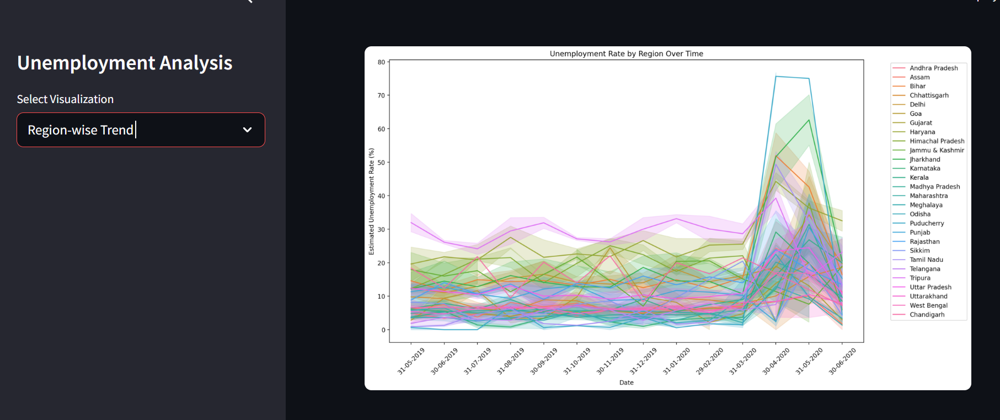
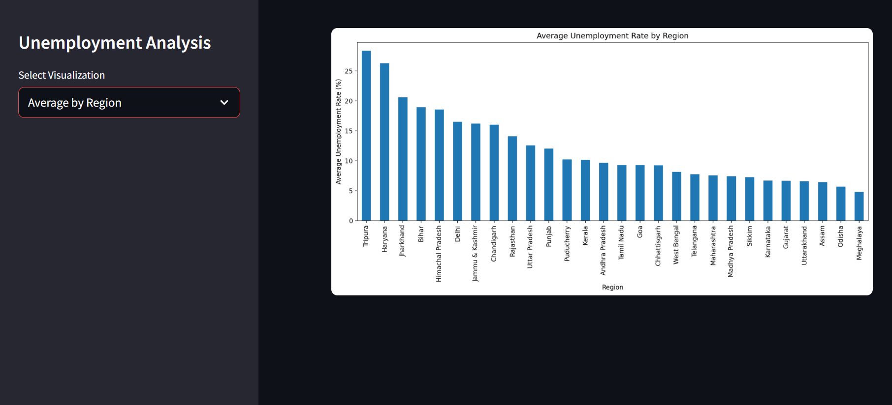
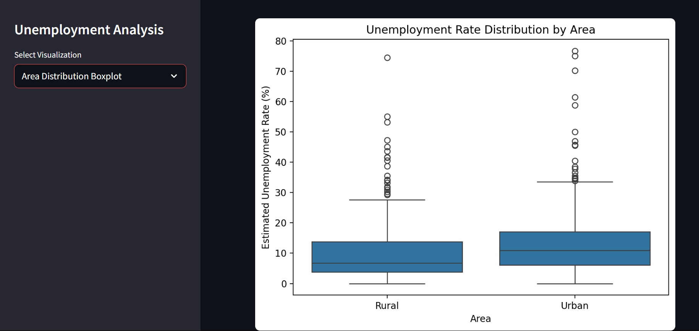
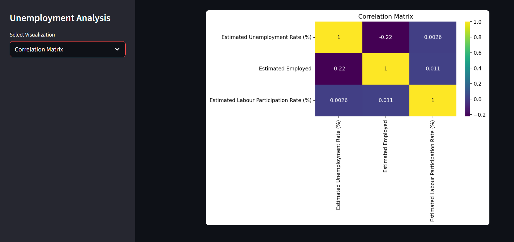
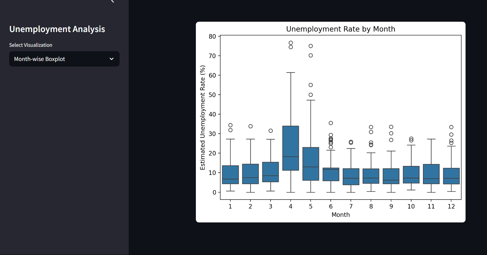

# 📊 Unemployment Analysis Dashboard (Streamlit)

An interactive **Streamlit web application** to visualize and analyze unemployment trends in India using various graphical representations. This project uses a cleaned unemployment dataset and provides multiple insightful visualizations for data-driven understanding.

---

## 📈 Features

- 📅 India's overall unemployment trend over time  
- 🌍 Region-wise unemployment trends  
- 📊 Average unemployment rate by region  
- 📦 Area-wise distribution using boxplots  
- 🔍 Correlation matrix heatmap between different unemployment metrics  
- 📆 Month-wise unemployment distribution boxplot  

---

## 📸 Visualizations (Screenshots)

### 📍 India's Unemployment Trend  

---

### 📍 Region-wise Trend  

---

### 📍 Average by Region  

---

### 📍 Area Distribution Boxplot  

---

### 📍 Correlation Matrix  

---

### 📍 Month-wise Boxplot  

---

## 📦 Dataset

The cleaned dataset used for this analysis is named:
  
     cleaned_unemployment_data.csv 

It includes fields such as:
- `Date`
- `Region`
- `Area`
- `Estimated Unemployment Rate (%)`
- `Estimated Employed`
- `Estimated Labour Participation Rate (%)`
- `Month`

---

## 🛠️ Tech Stack

- **Python 3.x**
- **Streamlit**
- **Pandas**
- **Matplotlib**
- **Seaborn**
- **Custom Visualizations (`Viz_utils.py`)**

---

## Author
Arin Talavadekar

